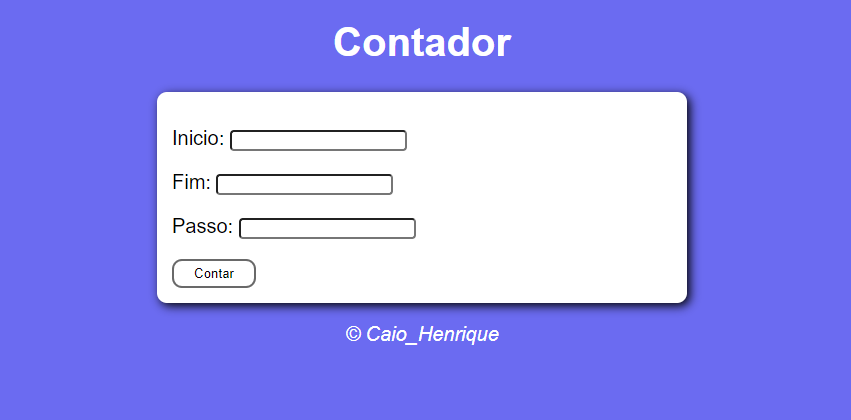
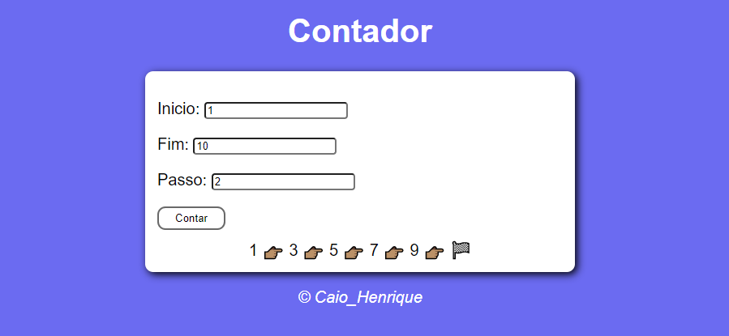
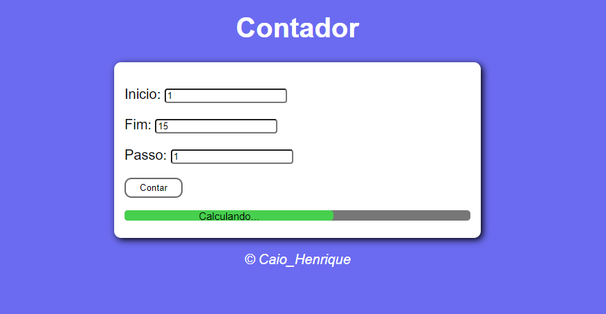

# Alarme ou Timer

## Sobre
Este projeto tem como finalidade desenvolvimento e aprendizado da linguagem Java Script.
Nele temos um simples contador, que vai de um número inicial até final em uma sequência 
pré determinada pelo usuário. 
Aproveitando da realização deste pequeno projeto, esta sendo estudados alguns 
conceitos de HTML e também CSS
E por último estou aprendendo alguns conceitos de uso do prórpio Git Hub!!

## Layout
 
 
 

## Tecnologias utilizadas
Foram usadas apenas estruturação e desenvolvimento de linguagens e ferramenetas para Front-End
neste projeto. Elas como já citadas anteriormente são:

 - Java Script;
 - HTML;
 - CSS.

## Como contribuir
Se você é um desenvolvedor com mais experiência, sempre tem algumas dicas para dar aos mais novos,
então no que puder acrescentar ao meu trabalho e ao meu crescimento como um desenvolvedor, estarei 
sempre de portas abertas para ouvir aos conselhos e ensinamentos que tiveram para dar!!

## Autor 

 - Caio Henrique Marques da Silva
 - LinkedIn: https://www.linkedin.com/in/caio-henrique-56b713200/
 - Instagram: caiohenrique3